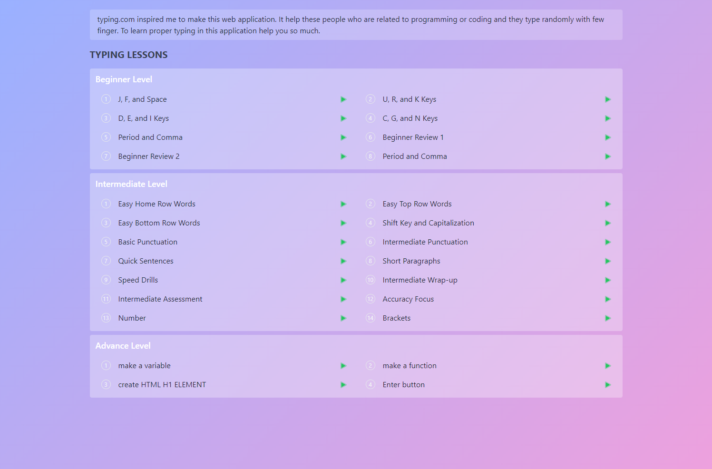
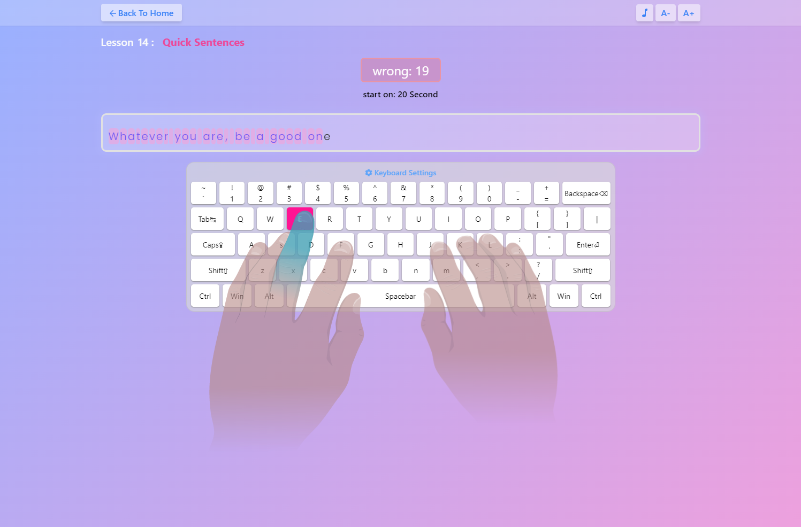
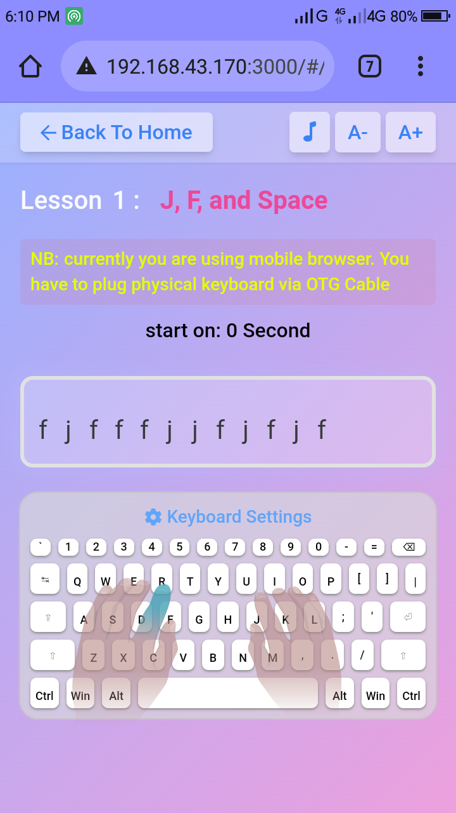

### Typing-Fun Web application

typing.com inspired me to make this web application. It help these people who are related to programming or coding and they type randomly with few finger. To learn proper typing in this application help you so much.

[Live live https://rsl-typing-fun.netlify.app](https://rsl-typing-fun.netlify.app)

### Technology I uses

- Reactjs,
- Tailwindcss,
- Scss,
- react-router-dom@6
- React Context Api for State managment
- Code Splitting with React lazy loading
- 

 

### mobile view

